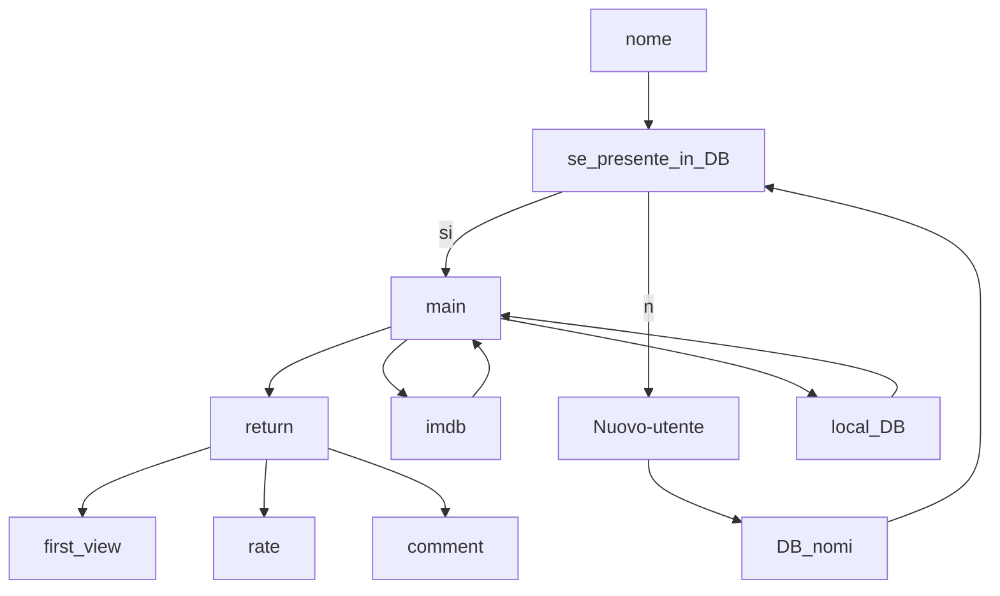

#Progetto mobile programming

##struttura logica

# 🎯 Kotlin Android OMDb Movie App - To Do List

## ✅ Stage 1: Setup e Architettura di Base
- ✅ Inizializzare progetto Android Kotlin
- ✅ Aggiungere dipendenze:
  - ✅ Retrofit
  - ✅ Gson/Moshi
  - ✅ Room
  - ✅ Hilt/Dagger (per DI)
  - ✅ Navigation Component
- ✅ Definire modelli dati per:
  - ✅ `SearchResult` (output di `?s=`)
  - ✅ `MovieDetail` (output di `?i=`)
- ✅ Creare interfaccia Retrofit:
  - ✅ `searchMoviesByTitle(title: String)`
  - ✅ `getMovieDetails(imdbID: String)`
- ✅ Abilitare Internet permission in `AndroidManifest.xml`

---

## ✅ Stage 2: UI Base e Navigazione
- ✅ Creare schermate:
  - ✅ `SearchScreen` con barra di ricerca
  - ✅ `FavoritesScreen` con lista film preferiti
- ✅ Configurare Navigation Component
- ✅ Impostare tema/material base

---

## ✅ Stage 3: Ricerca Film e Lista Espandibile
- ✅ Creare ViewModel per `SearchScreen`
- ✅ Effettuare chiamata `?s=` con Retrofit
- ✅ Per ogni risultato, chiamare `?i=` per ottenere dettagli completi
- ✅ Costruire lista RecyclerView:
  - ✅ Item base con titolo, anno, poster
  - ✅ Espandibile per mostrare dettagli (runtime, trama, regista, ecc.)
- ✅ Gestire stati:
  - ✅ Loading
  - ✅ Nessun risultato
  - ✅ Errore rete

---

## ✅ Stage 4: Gestione Database Locale (Room)
- ✅Creare entità Room:
  - ✅ `FavoriteMovieEntity` (con imdbID)
  - ✅ `MovieMetadataEntity` (con voto, commento, data visione)
- ✅ Collegare le entità con relazione (1:1 su imdbID)
- ✅ Creare DAO:
  - ✅ `insertFavorite(movie)`
  - ✅ `deleteFavorite(imdbID)`
  - ✅ `getAllFavorites()`
  - ✅ `getFavoriteWithMetadata(imdbID)`
  - ✅ `filterFavoritesByTitle(query)`
- ✅ Costruire ViewModel per `FavoritesScreen`

---

## ✅ Stage 5: Gestione UI dei Preferiti
- ✅ Schermata `FavoritesScreen`:
  - ✅ RecyclerView per lista dei preferiti
  - ✅ Ogni item mostra titolo, voto, data visione, commento
- ✅ Aggiungere barra di filtro (EditText):
  - ✅ Collegata in tempo reale a filtro in ViewModel
- ✅ Aggiungere funzionalità modifica/eliminazione preferito
- ✅ Gestire empty state e messaggi di feedback

---

## ✅ Stage 6: Form per Salvataggio Preferiti
- ✅ In ogni item della `SearchScreen`:
  - ✅ Aggiungere bottone “Aggiungi ai preferiti”
  - ✅ Mostrare form di inserimento:
    - ✅ Data prima visione (DatePicker)
    - ✅ Voto personale (RatingBar o Slider)
    - ✅ Commento (EditText)
- ✅ Validare i dati inseriti
- ✅ Salvare nei database `FavoriteMovieEntity` + `MovieMetadataEntity`

---

## ✅ Stage 7: Testing, UX e Ottimizzazione
- [ ] Aggiungere ProgressBar e animazioni base
- ✅ Gestire errori API con messaggi chiari
- [ ] Ottimizzare chiamate API (evitare duplicati)
- [ ] Debounce su ricerca titoli
- [ ] Testing:
  - [ ] Unit test su DAO
  - [ ] Test ViewModel
  - [ ] Test UI base (opzionale)

---

## ✅ Stage 8: Finalizzazione e Documentazione
- [ ] Scrivere README con:
  - [ ] Descrizione app
  - [ ] Funzionalità
  - [ ] Screenshot (facoltativo)
  - [ ] Istruzioni di build
- [ ] Pulizia codice
- [ ] Verifica licenze API (OMDb è free con API key)
- [ ] Prepara APK/debug build per demo

