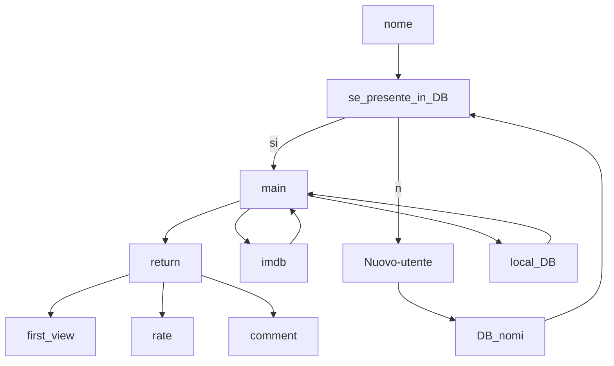

#Progetto mobile programming

##struttura logica

```mermaid
graph TD;
  login[nome]-->controllo_nome[se_presente_in_DB];
  DB_nomi-->controllo_nome[se_presente_in_DB];
  controllo_nome[se_presente_in_DB]--si-->main;
  controllo_nome[se_presente_in_DB]--no-->Nuovo-utente;
  Nuovo-utente-->DB_nomi;
  main-->imdb;
  imdb-->main;
  main-->return;
  main-->local_DB;
  local_DB-->main;
  return-->first_view;
  return-->rate;
  return-->comment;
```
